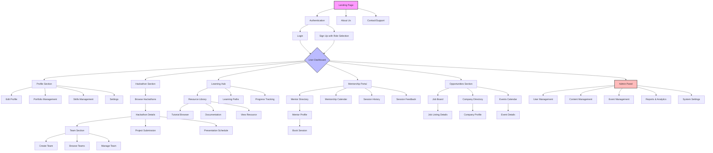

```mermaid

graph TD
    Home[Landing Page] --> Auth[Authentication]
    Auth --> Login
    Auth --> SignUp[Sign Up with Role Selection]

    Home --> About[About Us]
    Home --> Contact[Contact/Support]

    Login --> Dashboard{User Dashboard}
    SignUp --> Dashboard

    Dashboard --> Profile[Profile Section]
    Profile --> ProfileEdit[Edit Profile]
    Profile --> Portfolio[Portfolio Management]
    Profile --> Skills[Skills Management]
    Profile --> Settings

    Dashboard --> Hackathons[Hackathon Section]
    Hackathons --> HackathonList[Browse Hackathons]
    HackathonList --> HackathonDetails[Hackathon Details]
    HackathonDetails --> TeamSection[Team Section]
    TeamSection --> CreateTeam[Create Team]
    TeamSection --> BrowseTeams[Browse Teams]
    TeamSection --> ManageTeam[Manage Team]
    HackathonDetails --> Submit[Project Submission]
    HackathonDetails --> Schedule[Presentation Schedule]

    Dashboard --> Learning[Learning Hub]
    Learning --> Resources[Resource Library]
    Resources --> Tutorials[Tutorial Browser]
    Resources --> Docs[Documentation]
    Resources --> ResourceView[View Resource]
    Learning --> LearningPath[Learning Paths]
    Learning --> Progress[Progress Tracking]

    Dashboard --> Mentorship[Mentorship Portal]
    Mentorship --> MentorList[Mentor Directory]
    MentorList --> MentorProfile[Mentor Profile]
    MentorProfile --> BookSession[Book Session]
    Mentorship --> Calendar[Mentorship Calendar]
    Mentorship --> SessionHistory[Session History]
    Mentorship --> Feedback[Session Feedback]

    Dashboard --> Opportunities[Opportunities Section]
    Opportunities --> Jobs[Job Board]
    Jobs --> JobDetails[Job Listing Details]
    Opportunities --> Companies[Company Directory]
    Companies --> CompanyProfile[Company Profile]
    Opportunities --> Events[Events Calendar]
    Events --> EventDetails[Event Details]

    Dashboard --> Admin[Admin Panel]
    Admin --> UserMgmt[User Management]
    Admin --> ContentMgmt[Content Management]
    Admin --> EventMgmt[Event Management]
    Admin --> Analytics[Reports & Analytics]
    Admin --> SysSettings[System Settings]

    style Home fill:#f9f,stroke:#333,stroke-width:2px
    style Dashboard fill:#bbf,stroke:#333,stroke-width:2px
    style Admin fill:#fbb,stroke:#333,stroke-width:2px
```
